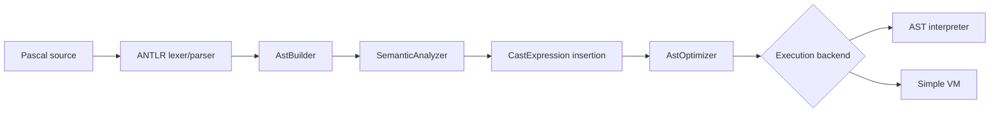

# Архитектура и пайплайн

Проект организован в слои: синтаксис, AST, семантика, оптимизация, исполнение.

## Пайплайн обработки

## Слои проекта

1. `parser`

- грамматика Pascal;
- построение AST;
- диагностика синтаксиса.

2. `ast`

- дерево программы;
- выражения;
- операторы;
- объявления;
- visitors.

3. `semantic`

- проверка типов;
- области видимости;
- проверка вызовов;
- подготовка AST к исполнению.

4. `optimize`

- упрощение константных выражений;
- удаление недостижимых ветвей;
- примитивная нормализация AST.

5. `runtime`

- AST-интерпретатор.

6. `vm`

- простая стековая виртуальная машина;
- генерация инструкций;
- выполнение bytecode.

## Ключевые точки входа

1. [Main.java](../src/main/java/org/nahap/Main.java)
2. [AstBuilder.java](../src/main/java/org/nahap/parser/AstBuilder.java)
3. [SemanticAnalyzer.java](../src/main/java/org/nahap/semantic/SemanticAnalyzer.java)
4. [AstOptimizer.java](../src/main/java/org/nahap/optimize/AstOptimizer.java)
5. [PascalInterpreter.java](../src/main/java/org/nahap/runtime/PascalInterpreter.java)
6. [SimpleVmExecutor.java](../src/main/java/org/nahap/vm/SimpleVmExecutor.java)
