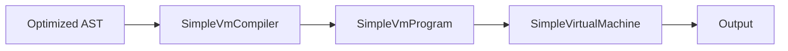

# Исполнение: AST и Simple VM

В проекте есть два варианта исполнения программы.

## 1. AST-интерпретатор

AST-интерпретатор выполняет дерево напрямую.

### Особенности

1. Работает на уровне узлов AST.
2. Поддерживает полный текущий набор возможностей проекта.
3. Удобен как эталонный backend.

### Основной класс

[PascalInterpreter.java](../src/main/java/org/nahap/runtime/PascalInterpreter.java)

## 2. Simple VM

Simple VM — это стековая виртуальная машина для базового подмножества языка.

### Поддерживаемый минимум

1. Арифметика.
2. Сравнения.
3. Условия `if/else`.
4. Циклы `while`, `for`, `repeat until`.
5. Переменные.
6. `WriteLn`.

### Архитектура

### Как работает VM

1. Компилятор проходит по AST visitor-ом.
2. Он генерирует список инструкций и таблицу переменных.
3. VM выполняет инструкции в стековой модели.
4. Управляющий поток реализуется через переходы по меткам.

### Основные классы

1. [SimpleVmCompiler.java](../src/main/java/org/nahap/vm/SimpleVmCompiler.java)
2. [SimpleVmProgram.java](../src/main/java/org/nahap/vm/SimpleVmProgram.java)
3. [SimpleVirtualMachine.java](../src/main/java/org/nahap/vm/SimpleVirtualMachine.java)
4. [SimpleVmExecutor.java](../src/main/java/org/nahap/vm/SimpleVmExecutor.java)

## Выбор backend

Класс [Main.java](../src/main/java/org/nahap/Main.java) поддерживает запуск через AST-интерпретатор или через VM в режиме `--vm`.
